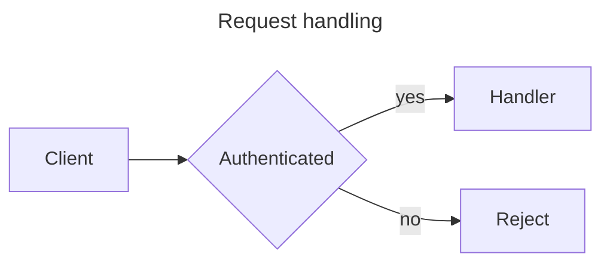

---
paths:
  - "**/*.mmd"
  - "**/*.mermaid"
description: Mermaid diagram authoring standards, validation mandate, and managed-diagram constraint.
---

# Mermaid Diagram Standards

This rule governs Mermaid diagrams in this repository. The authoring workflow, the per-type syntax
references, and the generation recipes live in `.claude/skills/mermaid-diagram/SKILL.md`; this file
carries the constraints.

The pinned Mermaid documentation version for the whole surface is **11.17.0**
(https://mermaid.js.org/intro/syntax-reference.html). The keyword allowlist and the per-type arrow
token sets are a snapshot of that version, recorded in `.claude/lib/mermaid/MermaidGrammar.psm1`.

## Diagram File Conventions

- A standalone diagram belongs in a `.mmd` file (`.mermaid` is also recognized). The whole file is
  one diagram: optional YAML frontmatter, optional `%%{init: ...}%%` directives, the diagram-type
  keyword line, then the body.
- A diagram embedded in prose belongs in a fenced ` ```mermaid ` block in the Markdown file that
  discusses it. GitHub renders such fences natively in Markdown, pull requests, and issues.
- The first line after any frontmatter, directive, comment, and blank line must be the
  diagram-type keyword. Mermaid keywords are case-sensitive: `C4Context`, `stateDiagram-v2`, and
  `sequenceDiagram` are exact spellings.
- Mermaid has no backslash escape. To place a double quote inside a label, use the `#quot;` entity;
  a backslash before a closing quote closes the span rather than escaping it.
- Do not commit a diagram file as a test fixture. Diagram fixtures belong in PowerShell
  here-strings inside the Pester suites, because a `PreToolUse` hook fires on the write of its own
  fixtures.

## Validation Mandate

Every diagram written to this repository passes through the structural gate
`.claude/hooks/enforce-mermaid-validation.ps1` on `Write` and `Edit`. The gate is registered in the
`Write|Edit` matcher of `.claude/settings.json` and runs the dependency-free validator in
`.claude/lib/mermaid/`.

What the gate rejects, naming the defect class and the line number:

- a missing, non-keyword, or misspelled first-line diagram keyword;
- YAML frontmatter that opens with `---` and is never closed;
- an empty or whitespace-only diagram body;
- unbalanced `[]`, `()`, or `{}` on structural lines of a bracket-structural diagram type,
  computed by a quote-aware scanner;
- an unterminated double-quoted label;
- an arrow or edge token that is not valid for the declared diagram type;
- a `subgraph` with no matching `end`.

What the gate does NOT do, stated plainly so "validated" is not overclaimed: it does not prove a
diagram renders, and it performs no parse. Semantic and deep-grammar errors — an undefined node
reference in a `click` statement, a malformed gantt date, an invalid `classDef` property, a wrong
`section` structure, an invalid participant reference — are outside its reach. A `Valid` verdict
means no defect of a checked class was found, nothing more.

Where the gate declines to judge, it allows. An unknown but keyword-shaped first-line token is
allowed with a drift warning, because the allowlist is a pinned snapshot and an out-of-date
allowlist must cost a warning rather than a false rejection. Diagram types outside the deep-checked
set (flowchart, sequence, class, state, ER) are keyword-checked only. An `Edit` payload carries a
fragment rather than the resulting file, so the syntax check is not attempted and the next `Write`
catches a regression.

## Managed Diagrams: Do Not Hand-Edit

A `.mmd` or `.mermaid` file whose frontmatter carries an `id:` key is connected to the Mermaid Chart
cloud sync workflow:

```yaml
---
id: cbd9e9ba-a2cb-47c5-a98e-8c28a753428d
---
```

Such a diagram must not be hand-edited. The next sync overwrites the edit, so the change is lost
and the diff is misleading in the meantime. The gate denies both `Write` and `Edit` on a file whose
on-disk frontmatter carries a non-empty `id:`, with the reason token
`MERMAID_MANAGED_DIAGRAM_BLOCKED:`.

To change a managed diagram, use the Mermaid Chart sync workflow in VS Code (Mermaid Chart
extension: **Sync Diagram with Mermaid**, then **Review Mermaid Sync**) and pull the synced result.
Connecting a diagram, reviewing a sync, and accepting or rejecting synced commits are interactive
VS Code actions; they are human steps, not automatable from a Claude Code session.

The opt-out marker below never suppresses this constraint: the marker applies to fenced blocks in
Markdown, and the managed-diagram gate is keyed on diagram file paths.

## Opt-Out Marker for Deliberate Counter-Examples

Documentation legitimately quotes invalid Mermaid to demonstrate a defect. Placing the exact HTML
comment on the line immediately preceding a fence suppresses validation for that one block:

```text
<!-- mermaid-validator: ignore -->
```

Rules for the marker:

- The comment text is exactly `mermaid-validator: ignore`, case-sensitive. Whitespace around the
  line and inside the comment delimiters is permitted.
- It must sit on the line immediately before the opening ` ```mermaid ` fence, with no intervening
  line, blank or otherwise.
- Its scope is exactly one block. A second counter-example needs its own marker; an unmarked
  invalid block in the same file is still denied.
- It applies only to fenced blocks in Markdown. Diagram files have no opt-out: a diagram file is by
  definition a diagram.
- A ` ```mermaid ` fence nested inside an outer, longer fence is already treated as example text
  rather than a diagram and needs no marker.

## Out of Scope: The Non-Portable Extension Mechanisms

The Copilot instruction pack at `.github/instructions/mermaid.instructions.md` relies on VS Code
extension mechanisms that no Claude Code session can invoke. They are recorded here so a later
reader does not read the omission as an oversight. The same record appears in
`.claude/skills/mermaid-diagram/SKILL.md`.

| Mechanism | Why it is not ported | What replaces it |
| --- | --- | --- |
| `mermaid-diagram-validator` LM tool | A VS Code Language Model API tool contributed by the extension; not an MCP tool and not callable from a Claude session | The structural gate in this repository, weaker than a real parse and documented as such |
| `mermaid-diagram-preview` LM tool, `mermaidChart.preview` | A VS Code webview | The conditional rendering paths in the skill; GitHub renders fences natively |
| `get-syntax-docs-mermaid` LM tool | A VS Code LM API tool | The bundled per-type references under the skill, pinned to 11.17.0, with a documented `WebFetch` fallback to mermaid.js.org |
| The sixteen `mermaidChart.*` command IDs | Each needs the VS Code command API, an active editor, and the extension host | Portable capabilities are ported by substitution: validation to the hook, generation to the skill recipes, preview to conditional rendering, sync cooperation to the `id:` guard. The command IDs themselves are not ported |
| `@mermaid-chart` Copilot Chat slash commands | Copilot Chat participants do not exist on the Claude surface | The eight generation intents are skill recipe sections |
| `mermaidChart.repairDiagram`, `mermaidChart.improveDiagram` | Mermaid AI credits and extension UI | The gate's specific defect messages plus ordinary editing. No credit-consuming path exists on this surface, so there is nothing to warn about |
| `mermaidChart.login`, `logout`, `connectDiagramToMermaidChart`, `syncDiagramWithMermaid`, `reviewAppCommits`, `regenerateDiagramWithMermaidAI` | Interactive OAuth and extension UI against the Mermaid Chart cloud | Human steps in VS Code. The automatable half is in scope and delivered: the `id:` managed-diagram guard above |
| `mermaidChart.createMermaidFile`, `mermaidChart.installAiSkills` | Extension UI; the second is the Copilot-surface distribution mechanism | Creating a diagram file is an ordinary `Write`. The Claude distribution mechanism is the bundled resources mirror plus the `pack-manifests/core.json` entry |
| Deep `mmdc`/Chromium validation | Chromium-backed, seconds-level latency, no validate-only mode; unfit for a per-write gate | Recorded as an optional CI-side follow-up consuming the validator's structured result |

## Example

A minimal valid diagram file, frontmatter included:


