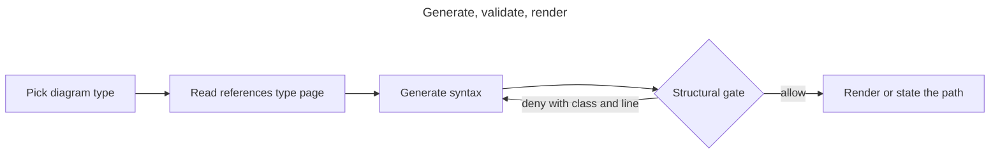

# Mermaid Diagram

Authoring workflow for Mermaid diagrams on the Claude runtime. The constraints — file conventions,
the validation mandate, the managed-diagram rule, and the opt-out marker — are in
`.claude/rules/mermaid.md`. This skill carries the workflow and the generation recipes.

Pinned Mermaid documentation version: **11.17.0**.

## Workflow: Generate, Validate, Render

1. **Determine the diagram type.** Pick from the per-type references below. When the type is
   unfamiliar, read its reference file before generating; when the reference does not answer the
   question, `WebFetch` the pinned documentation page (see [Syntax References](#syntax-references)).
2. **Generate the syntax.** Follow the reference's first-line keyword form and its arrow token set.
   Keywords are case-sensitive.
3. **Write the diagram.** A standalone diagram goes in a `.mmd` file; a diagram that belongs to
   prose goes in a fenced ` ```mermaid ` block in that document.
4. **Validate.** The `Write` is gated automatically by
   `.claude/hooks/enforce-mermaid-validation.ps1`. A deny names the defect class, the line number,
   and points back here. To check before writing, call the validator directly:

   ```powershell
   Import-Module ./.claude/lib/mermaid/MermaidValidation.psm1 -Force
   Test-MermaidDiagram -Content $diagramText
   ```

   The result carries `Verdict` (`Valid`, `Invalid`, `NotJudged`), `DiagramType`, `Findings` (each
   with `Class`, `Line`, `Message`), and `Warnings`.
5. **Render** per [Rendering](#rendering). Rendering is a workflow step, never something the hook
   does: a hook is a non-interactive subprocess whose stdout belongs to the hook protocol.

### What "validated" means here

The gate rejects the defect classes listed in `.claude/rules/mermaid.md`. It does not parse and it
cannot prove a diagram renders. Do not report a diagram as "validated" without that qualifier; say
the structural gate accepted it. Semantic errors — an undefined node reference, a malformed gantt
date, an invalid `classDef` property — pass the gate and still fail to render.

## Generation Recipes

Eight recipes, one per generation intent of the Copilot `@mermaid-chart` participant. Each names
the source to read, the diagram type to emit, and the shape that survives review.

### 1. Diagram from code (`/generate_diagram_from_code`)

Read the entry point and follow control flow outward one level at a time. Emit a `flowchart`
whose nodes are functions or modules and whose edges are calls. Keep node labels to the symbol
name; put qualifiers in a quoted label rather than in the identifier. Stop at the first boundary
the reader does not need (framework internals, third-party libraries) and mark it as one node.

### 2. Execution sequence (`/generate_execution_sequence`)

Emit a `sequenceDiagram`. One `participant` per process, service, or object that owns state;
messages in call order; the message text after the first colon carries the payload summary. Use
`-->>` for returns and `->>` for calls so the direction reads without the labels. Reserve `activate`
and `deactivate` for lifetimes the reader must see; they add noise otherwise.

### 3. ER diagram (`/generate_er_diagram`)

Read the schema, ORM models, or migration files. Emit an `erDiagram`. One entity per table, the
cardinality token pair chosen from the reference table, and the relationship label as the verb the
domain uses. Include an attribute block only for the columns that carry the relationship (keys) or
that the reader must see; a full column dump defeats the diagram.

### 4. Cloud or CI/CD architecture (`/generate_cloud_architecture_diagram`)

Read the infrastructure-as-code files and the workflow definitions. Emit a `flowchart` with one
`subgraph` per environment, account, or region boundary, and `-.->` for asynchronous or
event-driven edges against `-->` for synchronous ones. State the direction convention in a comment
so the next reader keeps it.

### 5. Docker architecture (`/generate_docker_diagram`)

Read the Dockerfiles and the compose file. Emit a `flowchart` with one node per service, one
`subgraph` per compose network, and edges labelled with the published or internal port. Show
volumes as nodes only when a volume is shared between services.

### 6. C4 top-down architecture (`/generate_c4_topdown_architecture`)

Emit `C4Context` for the system landscape, then `C4Container` for the chosen system, then
`C4Component` for the chosen container: one diagram per level, not one diagram with three levels.
Keywords carry a capital `C4`. Relationships use the `Rel(...)` call form rather than arrow tokens.
See `references/c4.md`.

### 7. Code ownership (`/analyze_code_ownership`)

Read `CODEOWNERS`, or derive ownership from directory structure when no such file exists. Emit a
`flowchart` with one `subgraph` per owning team and the owned directories as nodes. When ownership
is derived rather than declared, say so in the diagram title; an inferred ownership map presented
as authoritative is worse than none.

### 8. Dependency or security visualisation (`/generate_dependency_diagram`)

Read the manifest and lock files. Emit a `flowchart` for the dependency graph, direct dependencies
at the first level and transitive ones only where they matter to the question being asked. For a
security view, mark the affected node with a `classDef` and state the advisory identifier in the
label.

## Rendering

`Artifact` and `SendUserFile` are harness-dependent and are absent from some sessions. Take the
first available path:

1. **`Artifact` available.** Publish a Markdown artifact containing the ` ```mermaid ` fence. This
   is the preferred path: no CSP handling and no theme handling, unlike an HTML artifact.
2. **Else `SendUserFile` with `display: "render"` available.** Use it.
3. **Else** state that the diagram was written to its path and name the viewing route: the Mermaid
   Chart VS Code extension auto-previews `.mmd` and `.mermaid` files, the built-in VS Code Markdown
   preview renders fenced blocks, and GitHub renders ` ```mermaid ` fences natively in Markdown,
   pull requests, and issues.

Never claim a diagram was rendered when only path 3 was taken. Say where it was written and how to
view it.

## Opt-Out Marker

To quote invalid Mermaid deliberately, place the exact HTML comment on the line immediately before
the fence:

```text
<!-- mermaid-validator: ignore -->
```

The marker suppresses validation for exactly that one block, must have no intervening line before
the fence, applies only to Markdown fences, and never suppresses the managed-diagram guard. Full
rules are in `.claude/rules/mermaid.md`.

## Syntax References

Per-type references under `references/`, pinned to Mermaid 11.17.0:

| File | Covers |
| --- | --- |
| `references/flowchart.md` | `flowchart`, `graph`, `flowchart-elk` |
| `references/sequence.md` | `sequenceDiagram` |
| `references/class.md` | `classDiagram`, `classDiagram-v2` |
| `references/state.md` | `stateDiagram-v2`, `stateDiagram` |
| `references/er.md` | `erDiagram` |
| `references/c4.md` | `C4Context`, `C4Container`, `C4Component`, `C4Dynamic`, `C4Deployment` |
| `references/gantt.md` | `gantt` |
| `references/pie.md` | `pie` |
| `references/other-types.md` | every remaining keyword of the pinned table |

**`WebFetch` fallback.** The references are a snapshot, not the documentation. When a construct is
absent from them, or when a first-line keyword is not in the validator's allowlist, fetch the
pinned page and confirm the form before generating:

- entry point: `https://mermaid.js.org/intro/syntax-reference.html`
- per-type pages: `https://mermaid.js.org/syntax/<type>.html`

Confirming a keyword against the documentation is also the mechanism for updating
`.claude/lib/mermaid/MermaidGrammar.psm1` when Mermaid adds a diagram type: the validator warns
rather than blocks on an unknown keyword, so a warning is the signal to check and extend the table.

## Out of Scope

The VS Code extension mechanisms the Copilot instruction pack relies on are not reachable from a
Claude Code session. The full disposition table, one row per mechanism with its reason and its
replacement, is in `.claude/rules/mermaid.md` under "Out of Scope: The Non-Portable Extension
Mechanisms". In summary: the three LM tools, the sixteen `mermaidChart.*` command IDs, the
`@mermaid-chart` chat participants, and the Mermaid Chart cloud login/sync/review flows are not
ported; validation, generation, preview, and sync cooperation are ported by substitution to the
hook, these recipes, the rendering paths above, and the `id:` guard. Deep `mmdc`/Chromium
validation in CI, and retrofitting the existing repository Mermaid emitters through this validator,
are recorded follow-ups.

## Worked Example


