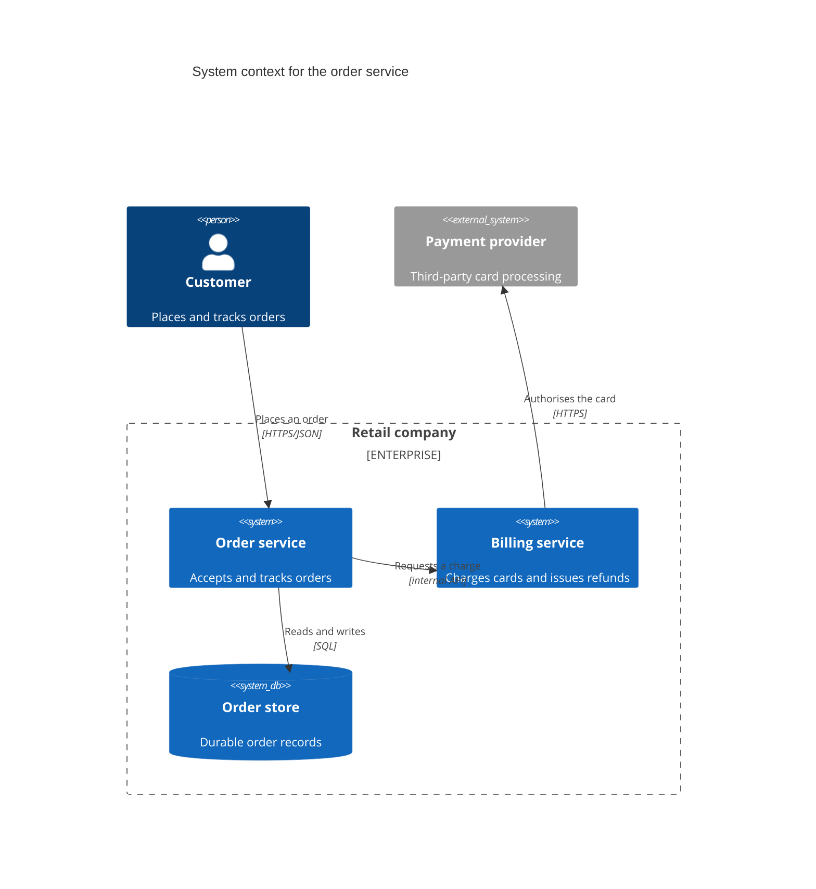

# C4 Diagram Syntax Reference

Pinned to Mermaid **11.17.0**. Source: `https://mermaid.js.org/syntax/c4.html`.
When a construct is absent here, `WebFetch` that page and confirm the form before generating.

## First-line keyword forms

`C4Context`, `C4Container`, `C4Component`, `C4Dynamic`, `C4Deployment`.

The capital `C4` is part of the keyword. `c4context` does not resolve, and the validator is
case-sensitive by design because Mermaid is.

Emit one diagram per C4 level rather than one diagram spanning levels: context first, then the
container view of the chosen system, then the component view of the chosen container.

## Statement forms

C4 uses call-style statements, not arrow tokens. The validator therefore keyword-checks a C4
diagram and does not judge its body.

- Elements: `Person(alias, label, description)`, `Person_Ext(...)`,
  `System(alias, label, description)`, `System_Ext(...)`, `SystemDb(...)`, `SystemQueue(...)`,
  `Container(alias, label, technology, description)`, `ContainerDb(...)`, `ContainerQueue(...)`,
  `Component(alias, label, technology, description)`.
- Boundaries: `Enterprise_Boundary(alias, label) { ... }`, `System_Boundary(...)`,
  `Container_Boundary(...)`, `Boundary(alias, label, type)`. Braces are paired.
- Relationships: `Rel(from, to, label, technology)` plus the directional variants `Rel_U`, `Rel_D`,
  `Rel_L`, `Rel_R`, and `BiRel(...)` for a two-way relationship.
- Layout: `UpdateLayoutConfig($c4ShapeInRow, $c4BoundaryInRow)`. Styling:
  `UpdateElementStyle(alias, $bgColor, $fontColor, $borderColor)`,
  `UpdateRelStyle(from, to, $offsetX, $offsetY)`.

## Example

