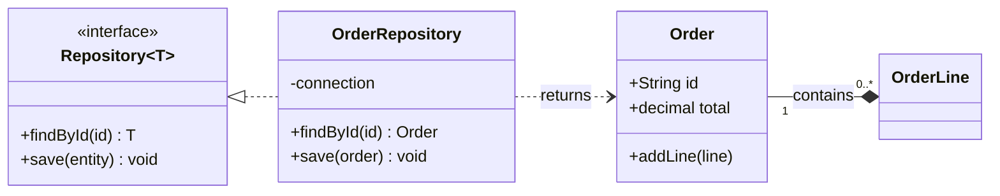

# Class Diagram Syntax Reference

Pinned to Mermaid **11.17.0**. Source: `https://mermaid.js.org/syntax/classDiagram.html`.
When a construct is absent here, `WebFetch` that page and confirm the form before generating.

## First-line keyword forms

`classDiagram`, or the legacy-accepted `classDiagram-v2`.

## Relation tokens

A relation is composed as `<tail><line><head>`:

| Token | Meaning |
| --- | --- |
| `<|--` / `--|>` | inheritance |
| `*--` / `--*` | composition |
| `o--` / `--o` | aggregation |
| `-->` / `<--` | association |
| `--` | link, solid |
| `..>` / `<..` | dependency |
| `..|>` / `<|..` | realization |
| `..` | link, dashed |

Cardinalities are quoted and sit outside the token: `Customer "1" --> "0..*" Order`.
Generics use tilde runs: `List~T~`, and a tilde run is never an edge defect.

## Structural conventions

- A member block is `class <Name> { ... }` with `+`, `-`, `#`, `~` visibility prefixes; methods
  carry `()`. Brackets and braces are structural in a class diagram, so every opener needs a closer.
- A member may also be declared inline: `Animal : +String name`.
- `namespace <Name> { ... }` groups classes.
- Annotations use `<<interface>>` / `<<abstract>>` on their own line inside the block or after the
  class name.
- `classDef`, `cssClass`, `click`, `style`, `note`, `note for <Class>` are statement lines exempt
  from the edge rules.
- Text after the first `:` on a relation line is the relation label and is free text.

## Example

