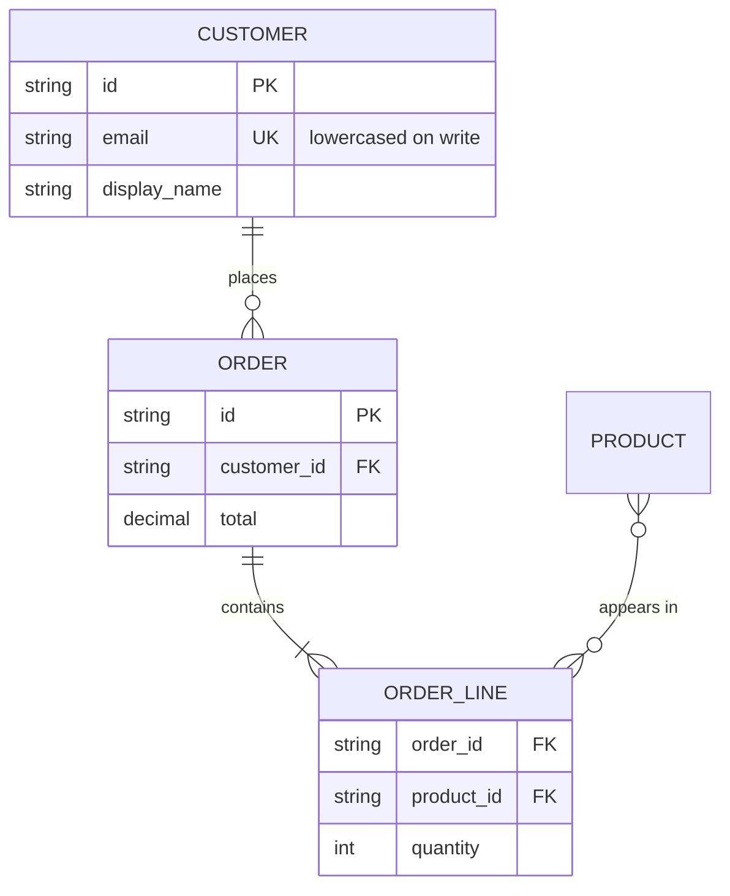

# Entity Relationship Diagram Syntax Reference

Pinned to Mermaid **11.17.0**. Source: `https://mermaid.js.org/syntax/entityRelationshipDiagram.html`.
When a construct is absent here, `WebFetch` that page and confirm the form before generating.

## First-line keyword form

`erDiagram`.

## Cardinality tokens

A relationship token is `<left><line><right>`.

| Position | Options |
| --- | --- |
| left | `\|o` (zero or one), `\|\|` (exactly one), `}o` (zero or more), `}\|` (one or more) |
| line | `--` (identifying), `..` (non-identifying) |
| right | `o\|` (zero or one), `\|\|` (exactly one), `o{` (zero or more), `\|{` (one or more) |

Common complete forms: `||--||`, `||--o{`, `}o--o{`, `}|--|{`, `|o..o|`, `}|..|{`.

Word aliases are also accepted in place of the token: `one or zero`, `zero or more`, `only one`,
`1+`, `0+`, `many(0)`, `many(1)`, joined by `to` or `optionally to`.

The relationship label follows the first `:` and is free text.

## Structural conventions

- An attribute block is `ENTITY { <type> <name> <key> "<comment>" }`. Braces are structural.
- Key markers are `PK`, `FK`, `UK`; several may be comma-separated.
- An entity name may be quoted when it is not identifier-shaped.
- `%%` comments and the statement keywords behave as in every other type.

## Example

