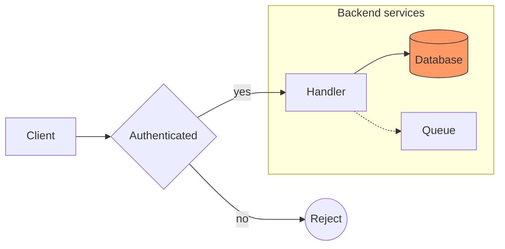

# Flowchart Syntax Reference

Pinned to Mermaid **11.17.0**. Source: `https://mermaid.js.org/syntax/flowchart.html`.
When a construct is absent here, `WebFetch` that page and confirm the form before generating.

## First-line keyword forms

- `flowchart` followed optionally by a direction: `TB`, `TD`, `BT`, `LR`, `RL`. The direction is
  optional and defaults to `TB`.
- `graph` with the same optional direction. Accepted and equivalent for the validator's purposes.
- `flowchart-elk` selects the ELK layout variant.
- A trailing `;` on the keyword line is accepted (`graph LR;`).

## Edge tokens

| Token | Meaning |
| --- | --- |
| `-->` | arrow |
| `---` | open link |
| `-.->` | dotted arrow |
| `-.-` | dotted open link |
| `==>` | thick arrow |
| `===` | thick open link |
| `~~~` | invisible link |
| `--o` | circle edge |
| `--x` | cross edge |
| `o--o`, `x--x`, `<-->` | bidirectional forms |

Length variants extend the dash, dot, or equals run (`---->`, `====>`, `-...->`) and rank the edge
lower in layout. Text forms: `A -- text --> B`, `A -->|text| B`, `A -. text .-> B`,
`A == text ==> B`.

## Node shapes

`A[rect]`, `A(round)`, `A([stadium])`, `A[[subroutine]]`, `A[(cylinder)]`, `A((circle))`,
`A>asymmetric]`, `A{rhombus}`, `A{{hexagon}}`, `A[/parallelogram/]`, `A[\parallelogram alt\]`,
`A[/trapezoid\]`, `A(((double circle)))`.

Brackets are structural in a flowchart, so every opener needs its closer. A bracket inside a quoted
label is content, not structure: `A["foo[bar](baz)"]` is valid.

## Structural conventions

- `subgraph <id> [<free-text title>]` opens a block; `end` closes it. A `direction` statement inside
  a subgraph sets that subgraph's direction.
- Statement lines are exempt from edge and bracket rules: `click`, `style`, `classDef`, `linkStyle`,
  `class`, `accTitle`, `accDescr`, `title`.
- `%%` starts a comment outside a quoted span. `%%{init: {...}}%%` is a directive, not a comment.
- Labels may carry HTML (` `, `<b>`) and Markdown strings in backticks. Angle brackets are never
  structural.
- Mermaid has no backslash escape; use the `#quot;` entity for a double quote inside a label.

## Example

