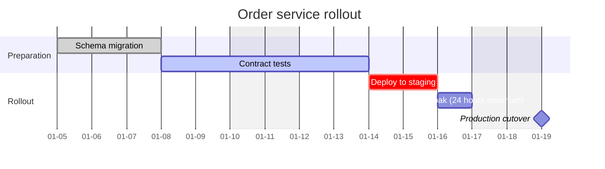

# Gantt Chart Syntax Reference

Pinned to Mermaid **11.17.0**. Source: `https://mermaid.js.org/syntax/gantt.html`.
When a construct is absent here, `WebFetch` that page and confirm the form before generating.

## First-line keyword form

`gantt`.

## Body form

A gantt body is free text to the validator: it carries no edge tokens, and brackets and parentheses
are not structural. A task named `Deploy (phase 1` is accepted by the gate even though it is
untidy, because rejecting it would be a false positive. The date and duration grammar is not
structurally checkable either, so a malformed date passes the gate and fails to render — check
dates by reading them.

Statement lines:

- `title <free text>`
- `dateFormat <format>` — the input format of the task dates, for example `YYYY-MM-DD`.
- `axisFormat <format>` — the output format of the axis, for example `%Y-%m-%d`.
- `tickInterval <n><unit>` — for example `1week`, `2day`.
- `excludes <weekends|YYYY-MM-DD|monday..sunday>`
- `todayMarker <off|stroke:...>`
- `section <free text>` opens a section; sections need no closing statement.

## Task form

`<task label> :<tags>, <id>, <start or dependency>, <duration or end>`

- Tags: `done`, `active`, `crit`, `milestone`.
- The start may be a literal date, `after <id>`, or omitted to continue from the previous task.
- The duration is a number with a unit (`3d`, `2w`, `12h`) or an explicit end date.

## Example

