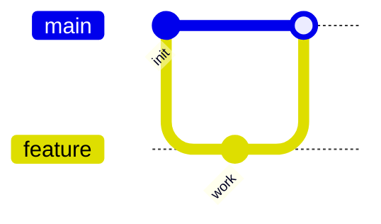
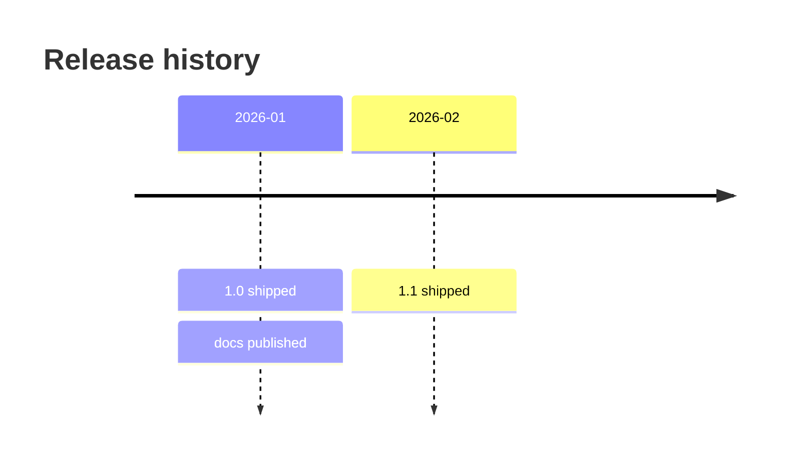
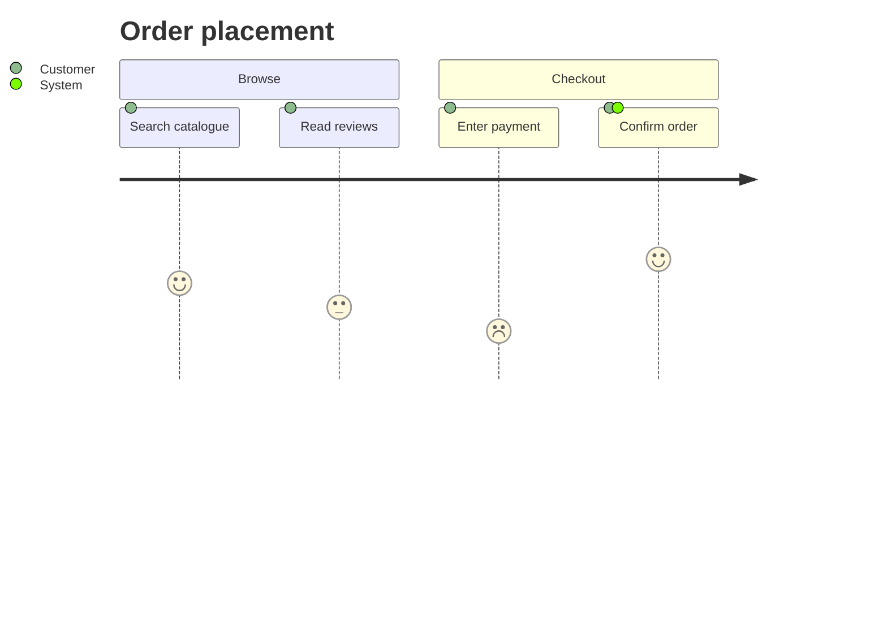

# Remaining Diagram Types

Pinned to Mermaid **11.17.0**. Entry point: `https://mermaid.js.org/intro/syntax-reference.html`;
per-type pages at `https://mermaid.js.org/syntax/<type>.html`. When a construct is absent here,
`WebFetch` the type's page and confirm the form before generating.

Every type on this page is **keyword-checked only** by the structural gate: the validator confirms
the first-line keyword and declines to judge the body, because these grammars are free text,
indentation-structured, CSV-like, or supplied by an external plugin. A body defect in one of these
types therefore passes the gate and fails to render. Read the body.

## Verified keyword forms

| Keyword | Type | Body shape |
| --- | --- | --- |
| `journey` | User journey | `section <name>` then `Task: <score>: <Actor>, <Actor>` rows |
| `quadrantChart` | Quadrant chart | `x-axis`, `y-axis`, `quadrant-1`..`quadrant-4`, then `"<label>": [x, y]` points |
| `requirementDiagram` | Requirement diagram | `requirement`/`element` blocks in braces; relationships as `<a> - <verb> -> <b>` |
| `gitGraph` | Git graph | `commit`, `branch`, `checkout`, `merge`, `cherry-pick`. Accepts a direction and trailing colon: `gitGraph LR:`, `gitGraph TB:`, `gitGraph BT:` |
| `mindmap` | Mind map | indentation-structured; node shapes `((circle))`, `))cloud((`, `)bang(`, `{{hexagon}}` |
| `timeline` | Timeline | `title`, optional `section`, then `<period> : <event> : <event>` rows |
| `zenuml` | ZenUML sequence | requires the external `@mermaid-js/mermaid-zenuml` plugin even in browser Mermaid; the gate keyword-accepts and never judges the body |
| `sankey-beta` | Sankey diagram | CSV-like `source,target,value` rows |
| `xychart-beta` | XY chart | `title`, `x-axis`, `y-axis`, `bar [..]`, `line [..]`. Accepts the `horizontal` modifier: `xychart-beta horizontal` |
| `block-beta` | Block diagram | `columns <n>`, block ids, `space`, flowchart-style arrows between blocks |
| `packet` | Packet diagram | `<start>-<end>: "<name>"` rows. `packet-beta` was the earlier keyword and remains accepted |
| `kanban` | Kanban board | indentation-structured columns and cards |
| `architecture-beta` | Architecture diagram | `group`, `service`, `junction`; edges carry port syntax `L`/`R`/`T`/`B`, as in `db:L -- R:server` |
| `radar-beta` | Radar chart | axis list then per-series value rows |
| `treemap-beta` | Treemap | indentation plus `"<label>": <value>` rows |
| `info` | Version info | no body; renders the Mermaid version |

## Keyword-accept rows: documented types, unverified keyword form

These types appear in the 11.x documentation sidebar, but their exact first-line keyword form was
not individually verified against the pinned pages. The validator resolves them and records a drift
warning rather than judging the body, so neither spelling costs a false rejection. Confirm the form
by `WebFetch` before relying on one.

`swimlanes`, `eventmodeling`, `venn`, `ishikawa`, `wardley`, `cynefin`, `treeView`, `railroad`
(`railroad-beta`).

## Version drift

The allowlist in `.claude/lib/mermaid/MermaidGrammar.psm1` is a snapshot of 11.17.0, and Mermaid adds
diagram types several times a year. An unknown but keyword-shaped first-line token produces a drift
warning and is allowed. That warning is the signal to confirm the keyword against the documentation
and add it to the table; it is never a reason to abandon the diagram.

One exception: a token within a single character of a known keyword and at least five characters
long is reported as a misspelling and denied, because a typo is a defect the gate is required to
name. `flowchar TD` is a misspelling of `flowchart`, not a new diagram type.

## Examples

