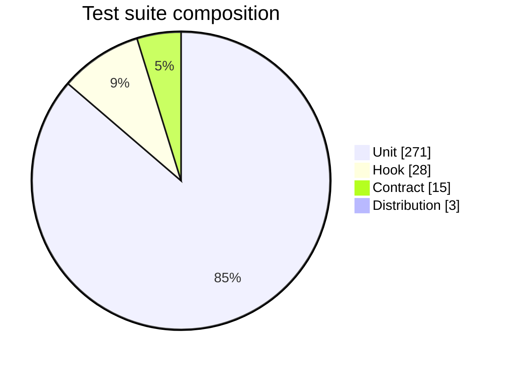

# Pie Chart Syntax Reference

Pinned to Mermaid **11.17.0**. Source: `https://mermaid.js.org/syntax/pie.html`.
When a construct is absent here, `WebFetch` that page and confirm the form before generating.

## First-line keyword forms

- `pie`
- `pie showData` — the modifier appends each slice's numeric value to its legend label.

## Body form

- `title <free text>` is optional and appears above the chart.
- Each data row is `"<label>" : <number>`. The label is double-quoted; the value may be an integer
  or a decimal. Mermaid computes the percentages, so values need not sum to 100.
- Up to twelve slices render with distinct default colours; beyond that the palette repeats, so
  aggregate the tail into one slice rather than emitting twenty.

The body carries no edge tokens and no structural brackets, so the validator keyword-checks a pie
chart and does not judge the body. An unquoted label or a non-numeric value passes the gate and
fails to render; read the rows.

## Example

