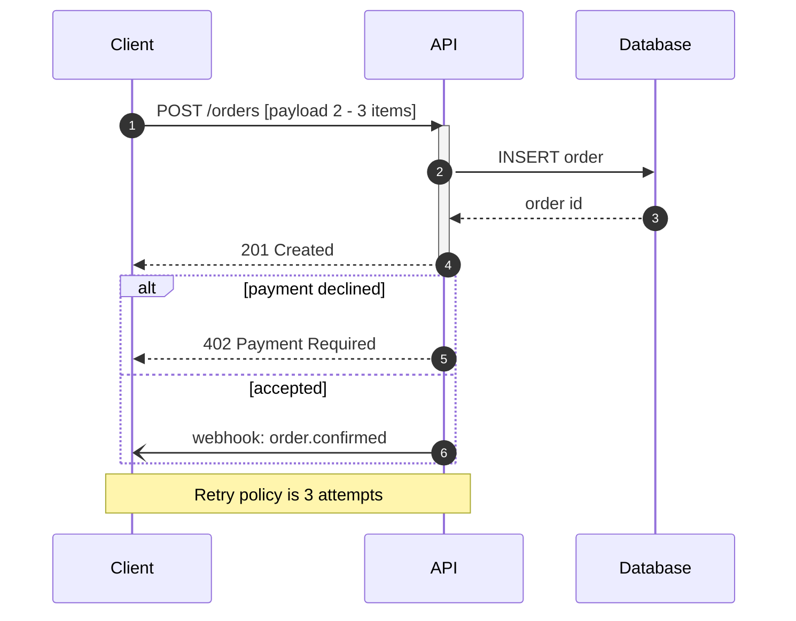

# Sequence Diagram Syntax Reference

Pinned to Mermaid **11.17.0**. Source: `https://mermaid.js.org/syntax/sequenceDiagram.html`.
When a construct is absent here, `WebFetch` that page and confirm the form before generating.

## First-line keyword form

`sequenceDiagram`. No direction modifier.

## Message tokens

| Token | Meaning |
| --- | --- |
| `->` | solid line, no arrowhead |
| `-->` | dotted line, no arrowhead |
| `->>` | solid line with arrowhead |
| `-->>` | dotted line with arrowhead |
| `<<->>` | solid bidirectional |
| `<<-->>` | dotted bidirectional |
| `-x` | solid line with a cross (async, lost) |
| `--x` | dotted line with a cross |
| `-)` | solid line with an open arrow (async) |
| `--)` | dotted line with an open arrow |

Half-arrow variants (`-\`, `-/` families) were added in 11.12.3 and later.

Everything after the first `:` on a message line is free text: it may contain dashes, angle
brackets, and brackets, and it is never edge-checked. Only the pre-colon segment carries the
message token.

## Structural conventions

- `participant <id> as <label>` and `actor <id>` declare lifelines; declaration order fixes the
  left-to-right order.
- `activate <id>` / `deactivate <id>`, or a `+`/`-` suffix on the message token, mark activation.
- Block keywords: `loop`, `alt`, `else`, `opt`, `par`, `and`, `critical`, `break`, `rect`, `box`.
  Each block is closed by `end`.
- `Note left of <id>`, `Note right of <id>`, `Note over <id>,<id>` place notes.
- `autonumber` numbers messages. `create participant <id>` and `destroy <id>` manage lifeline
  lifetime.
- Brackets are NOT structural in a sequence diagram, because message text routinely contains them.

## Example

