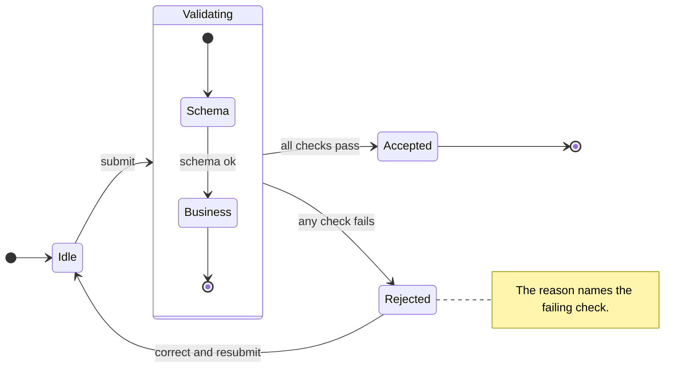

# State Diagram Syntax Reference

Pinned to Mermaid **11.17.0**. Source: `https://mermaid.js.org/syntax/stateDiagram.html`.
When a construct is absent here, `WebFetch` that page and confirm the form before generating.

## First-line keyword forms

`stateDiagram-v2` (preferred) or `stateDiagram` (legacy). Both accept a following `direction`
statement rather than a direction suffix on the keyword line.

## Transition token

`-->` is the only transition token. A single-dash `->` is a defect, and a sequence or class token in
a state diagram is a defect. Length variants (`--->`) are accepted.

The transition label follows the first `:` and is free text: `Idle --> Running: start button`.

## Structural conventions

- `[*]` is the start pseudo-state when it is the transition source and the end pseudo-state when it
  is the target.
- `state <Name> { ... }` declares a composite state; braces are structural, so every opener needs a
  closer. `direction` inside a composite sets that composite's direction.
- `state "free text description" as <id>` names a state whose label is not identifier-shaped.
- Fork and join use `<<fork>>` and `<<join>>` annotations; a choice point uses `<<choice>>`.
- `note left of <id>` / `note right of <id>` place notes; a `note` block is closed by `end note`.
- `--` inside a composite state separates concurrent regions.

## Example

