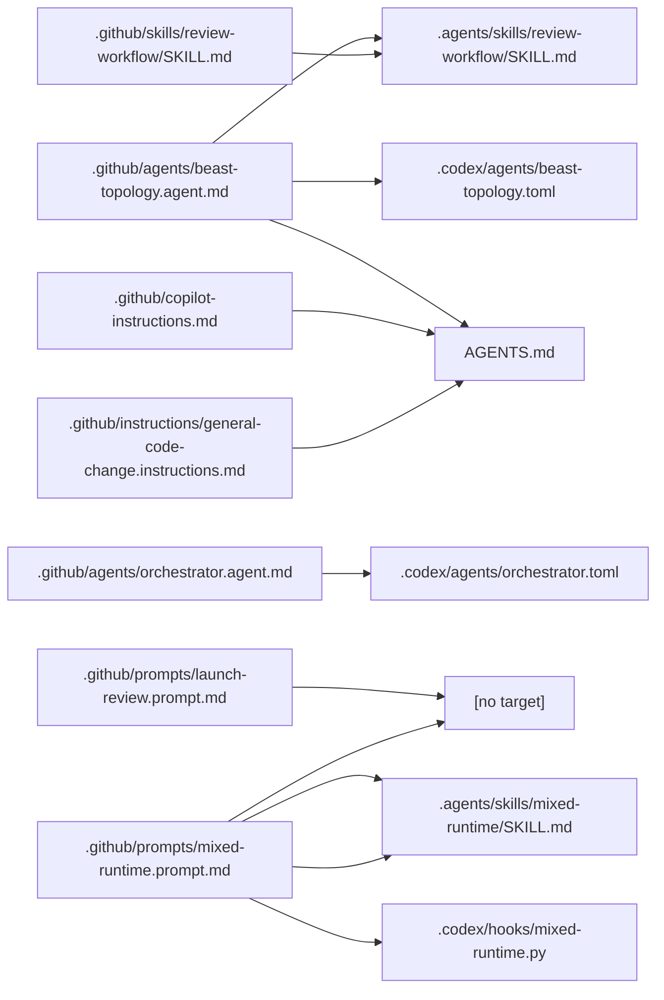
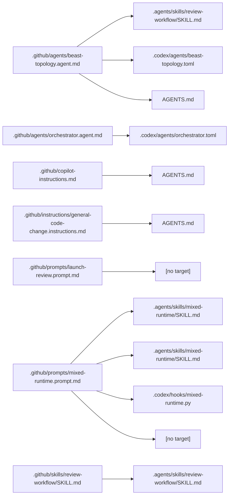
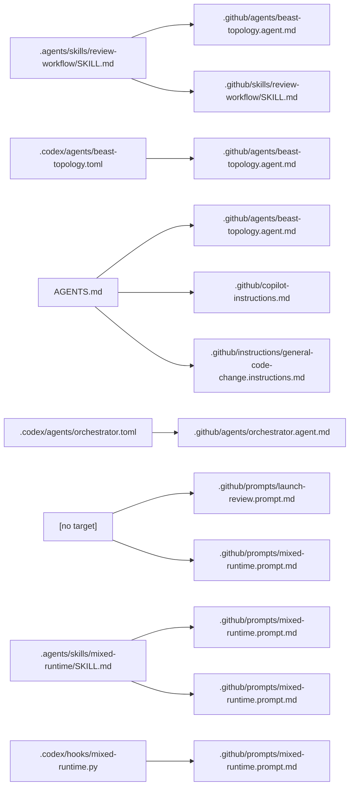

# Conversion Report

- Mode: `apply`
- Source ecosystem: `github-copilot`
- Source root: `tests/fixtures/codex_native_converter/github_copilot`
- Destination root: `virtual/destination`
- Artifact root: `virtual/apply-artifacts-debug`
- Mapping records: 7
- Validation findings: 2 (2 blocking)

## Mapping Topology

### Shared Destination Nodes

Source and destination nodes are both deduplicated in this view.

### Repeated Destination Nodes

Destination nodes may repeat in this source-to-destination view so fan-in stays legible.

### Repeated Source Nodes

Source nodes may repeat in this destination-to-source view so fan-out stays legible.

## Mappings

| Source path | Conversion class | Target role | Target path | Notes |
| --- | --- | --- | --- | --- |
| `.github/agents/beast-topology.agent.md` | `decomposed` | `subagent` | `.codex/agents/beast-topology.toml` |  |
| `.github/agents/orchestrator.agent.md` | `decomposed` | `subagent` | `.codex/agents/orchestrator.toml` | Agent manifest contains handoff semantics that require validation before apply mode. |
| `.github/copilot-instructions.md` | `direct` | `standing-guidance` | `AGENTS.md` |  |
| `.github/instructions/general-code-change.instructions.md` | `decomposed` | `standing-guidance` | `AGENTS.md` | Repo-wide instruction applies to all files and merges into standing guidance. |
| `.github/prompts/launch-review.prompt.md` | `unsupported` | `unsupported` | `` | Launcher prompts map only to the repository-convention .codex/prompts surface when explicitly enabled. Repository-convention prompt output is disabled for this run. |
| `.github/prompts/mixed-runtime.prompt.md` | `unsupported` | `unsupported` | `` | Launcher prompts map only to the repository-convention .codex/prompts surface when explicitly enabled. Repository-convention prompt output is disabled for this run. |
| `.github/skills/review-workflow/SKILL.md` | `direct` | `shared-skill` | `.agents/skills/review-workflow/SKILL.md` |  |

## Section Mappings

| Source path | Section | Intent | Target role | Target path | Notes |
| --- | --- | --- | --- | --- | --- |
| `.github/prompts/launch-review.prompt.md` | `Launcher Surface` | `launcher-only` | `launcher` | `` | Prompt launcher wrapper maps only to the repository-convention launcher surface. Repository-convention prompt output is disabled for this run. |
| `.github/prompts/mixed-runtime.prompt.md` | `Launcher Surface` | `launcher-only` | `launcher` | `` | Prompt launcher wrapper maps only to the repository-convention launcher surface. Repository-convention prompt output is disabled for this run. |
| `.github/prompts/mixed-runtime.prompt.md` | `Hard Gate` | `hook-candidate` | `hook` | `.codex/hooks/mixed-runtime.py` | Section contains hard-gate or forbidden-action language that resembles a native validation hook. |
| `.github/prompts/mixed-runtime.prompt.md` | `Launch Template` | `shared-workflow` | `shared-skill` | `.agents/skills/mixed-runtime/SKILL.md` | Section contains reusable workflow or output-contract content that maps more naturally to a shared skill. |
| `.github/prompts/mixed-runtime.prompt.md` | `Workflow` | `shared-workflow` | `shared-skill` | `.agents/skills/mixed-runtime/SKILL.md` | Section contains reusable workflow or output-contract content that maps more naturally to a shared skill. |

## Validation Findings

- `lingering-source-runtime-reference`: Generated output retains unresolved source-runtime references: GitHub Copilot runtime path
- `lingering-source-runtime-reference`: Generated output retains unresolved source-runtime references: GitHub Copilot runtime path
